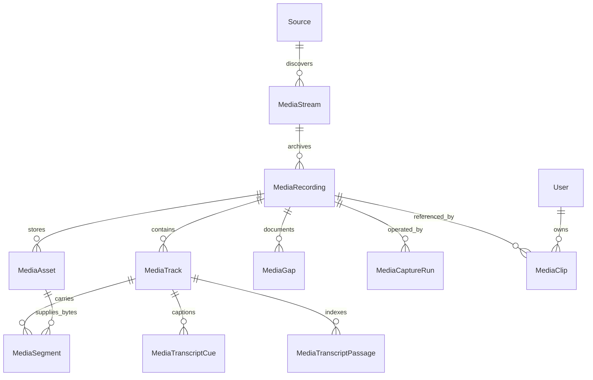

# Live media warehouse: CPAC first

> Historical design/review artifact. The implemented data model and behavior are documented in [the broadcast README](../broadcasts/README.md); transcript search now uses TIN, and precise re-encoded clipping is implemented.

Status: original design proposal, preserved for review history. The simplified V1 implementation and its deliberate differences are documented in [the broadcast runbook](../broadcasts/README.md).
Date: 2026-09-21. Branch: `feat/cpac-live-media`.

## Recommendation

Build a provider-independent media archive in `Warehouse`, with CPAC as the first discovery adapter. Capture CPAC TV and every simultaneous public event stream, retain the source media, extract English/French captions, and create remuxed playback outputs. Extend the authenticated Rails admin with live capture health, transcript search, playback, and clipping.

The core hierarchy is **source → stream → recording → tracks/segments/transcripts**. A stream is the provider's logical feed; a recording is a bounded archive on an immutable timeline. Neither a language nor a temporary manifest URL identifies a recording. This supports future radio, podcasts, uploaded public recordings, and other broadcasters without CPAC-specific tables.

User-owned clips, notes, capture preferences, and job leases are application data in the primary/public schema. Public source metadata, source bytes, and derived transcripts belong in the warehouse. R2 archival storage holds source and shared derived media; ActiveStorage holds user clip exports.

## What was verified against CPAC

On September 21, 2026, the public [live listing endpoint](https://www.cpac.ca/api/1/services/item-list.json?localId=%2Fsite%2Fcomponents%2Fcpac-item-lists%2Flivestreams.xml&removeCpacTv=false), also used by CPAC's website, returned `cpactv`, `live`, and `prelive` entries. Fields include `episodeId`, `program_id`, bilingual titles/descriptions/page URLs, `videoUrl`, and `liveDateTime`. This is an observed website interface, not a documented API contract; isolate it behind an adapter and fixture tests.

The inspected parliamentary [HLS manifest](https://cpac-ca-live.cdn.vustreams.com/groupb/live/a5f3bfd7-d491-415d-8d39-f8bd00a20b44/live.isml/.m3u8) exposed:

- One video ladder, up to 1080p, and separate English, French, and floor (`mul`) audio renditions.
- One advertised embedded caption group (`CLOSED-CAPTIONS`, `INSTREAM-ID="CC1"`) without subtitle playlist URLs or a caption language label.
- Video segments with program date/time anchors, sequence numbers, and durations around 3.2–6.4 seconds in the inspected playlist.

A four-segment sample contained ATSC A53 caption side data. FFmpeg extraction produced **English from caption field 1 and French from field 2**, despite only CC1 being advertised. This confirms bilingual extraction for this sample, not a universal service mapping for every CPAC feed. The initial stream-level `ffprobe` summary reported `closed_captions: 0`; decoded frame inspection and actual extraction established their presence. A header-only probe is insufficient.

The sampled CPAC TV manifest also exposed English/French audio and one caption group; its caption field language mapping has not yet been sampled. A separate live press event exposed only floor audio and no caption group. The TV listing's `liveDateTime` was in 2021: do not treat that field as the current TV programme start.

[CPAC's FAQ](https://www.cpac.ca/faq) says parliamentary proceedings and committees have bilingual captions; other programming is captioned in its predominant broadcast language. Missing French or English must therefore remain a visible availability state, never silently become machine translation.

Read-only probes downloaded four short public video segments to temporary storage. No capture service was started and no archive upload occurred. Implementation fixtures should retain compact listing/manifest examples and a small, approved test media fixture, not depend on these expiring URLs.

## Data model

Use bigint IDs to follow the existing warehouse convention, UTC `timestamptz` for wall-clock timestamps, bigint microseconds for recording offsets, and rational time bases with integer PTS values for native media timestamps. All tables have `created_at`/`updated_at`. JSONB holds provider evidence and codec-specific details, not relationships or frequently filtered fields.

### Public media dataset (`Warehouse::*`)

| Model / table | Meaning and principal fields | Identity and constraints |
| --- | --- | --- |
| Existing `Warehouse::Source` / `warehouse.sources` | One provider integration, initially `cpac_live`; use existing name, URL, format and provenance conventions. Discovery is handled by the media adapter, not the existing daily file-scrape scheduler. | Existing source identity. |
| `MediaStream` / `warehouse.media_streams` | A provider feed: source FK, `external_id`, `kind` (`continuous`, `event`, `on_demand`), `media_kind` (`video`, `audio`), `title_en/fr`, `description_en/fr`, `page_url_en/fr`, `manifest_url`, `protocol`, `provider_state`, `scheduled_start_at`, `first_seen_at`, `last_seen_at`, `metadata`. | Unique `(source_id, external_id)`. CPAC uses `episodeId`; TV IDs are feed IDs, not programme occurrences. URLs may change without changing identity. |
| `MediaRecording` / `warehouse.media_recordings` | A bounded archive: stream FK, `recording_key`, `timeline_origin_at`, `clock_basis` (`provider`, `estimated`), `started_at`, `ended_at`, `duration_us`, `state` (`open`, `finalized`, `partial`), snapshotted bilingual titles, `metadata`. | Unique `(media_stream_id, recording_key)`. Continuous feeds rotate daily at UTC boundaries; an event normally has one recording. At most one open recording per stream. Recordings describe captured evidence, not worker executions. |
| `MediaTrack` / `warehouse.media_tracks` | A logical video, audio, or caption track: recording FK, stable `track_key`, `kind`, `language` (BCP 47, `und`, or `mul`), `role` (`main`, `interpreted`, `floor`, `captions`), `delivery` (`separate`, `muxed`, `embedded`), optional `parent_track_id`, provider selector/service ID, codec, language evidence, first/last observed offsets, availability. | Unique `(recording_id, track_key)`. Embedded captions point to their video carrier; both must belong to the same recording. Service identity is independent of language, which may initially be unknown. Do not dedupe tracks solely by language. |
| `MediaSegment` / `warehouse.media_segments` | A captured transport unit: recording and carrier-track FKs, `epoch`, provider `discontinuity_sequence`, `media_sequence`, normalized byte-range offset/length, source URI, `start_us`, `end_us`, UTC anchor, raw PTS/time base, `asset_id`, optional `init_asset_id`, observed codec metadata. | Unique `(track_id, epoch, discontinuity_sequence, media_sequence, byte_range_offset, byte_range_length)`, with explicit non-null sentinels for absent ranges. `end_us > start_us`. Only successfully archived bytes become captured segments. Embedded caption tracks do not duplicate video segments. |
| `MediaAsset` / `warehouse.media_assets` | Immutable archived object: recording FK, optional track FK, `kind` (`discovery`, `manifest`, `init`, `source_segment`, `playback_part`, `caption_file`, `provenance`), object key, SHA-256, byte size, content type, optional time range, derivation key, recipe/version, provenance asset FK, availability (`available`, `purged`, `corrupt`). | Unique object key and derivation key where present. A provenance JSON object lists exact input asset IDs/checksums, selected tracks, time mapping, command/tool versions, and output checksums. No user clip title or owner here. |
| `MediaTranscriptCue` / `warehouse.media_transcript_cues` | Normalized caption display event: caption-track FK, `generation`, stable `cue_key`, `start_us`, `end_us`, `text`, optional provider cue ID, provenance asset FK, extractor version, `finalized_at`. | Unique `(track_id, generation, cue_key)`; valid positive time interval. Cue identity uses provider identity or source epoch/service/timing, never text alone. Preserve source spelling and errors. |
| `MediaTranscriptPassage` / `warehouse.media_transcript_passages` | Search-sized transcript window: caption-track FK, `generation`, deterministic window key, `start_us`, `end_us`, normalized text, content hash, plus existing `Searchable` revision/sequence/embedding fields. | Unique `(track_id, generation, window_key)`. Deterministic 30-second windows, extend at most to a cue boundary; record contributing cue IDs in provenance. This is a rebuildable projection, not primary evidence. |
| `MediaGap` / `warehouse.media_gaps` | Known missing coverage: recording FK, optional track FK, time range (nullable until known), expected missing sequence range, `reason`, `detected_at`, `resolved_at`, evidence asset FK. | Stable gap key for idempotent detection. Missing segments, timestamp resets without alignment, and absent caption coverage remain distinguishable. |

Caption tracks additionally hold `current_generation`. Re-extraction builds a new generation, validates it, then atomically switches the pointer and retires the previous search projection. The old source and extraction provenance remain available. A partially built generation is never mixed into the visible transcript.

`MediaAsset` serves both raw storage and immutable derived outputs, avoiding a second parallel file registry. Relationships between segments, tracks, cues, and assets must enforce same-recording ownership using composite foreign keys where possible. Track parents cannot reference themselves or form cycles. Source/recording deletion is restricted while evidence or clips refer to it.

### Application records (primary/public schema)

| Model | Fields and responsibility |
| --- | --- |
| `MediaCapturePolicy` | Source/stream reference, enabled state, discovery scope (TV and events), rendition ceiling, retention settings, concurrency and storage limits. Provider adapter key is allowlisted, not arbitrary executable configuration. |
| `MediaCaptureRun` | Recording reference, state, lease token and expiry, heartbeat, next poll time, durable per-track cursors, retry counts, error summary, capture/extraction/index freshness. One active lease per recording; workers renew it and use the token to fence stale writes. |
| `MediaClip` | User FK, recording reference, title, requested start/end offsets, audio-track selection, caption-track selections, output mode (`copy`, `exact`), state, actual exported boundaries, pinned input/provenance digest, recipe version, error, ActiveStorage attachment(s). A saved clip range exists before rendering. |

These references may be cross-schema FKs in the current installation, which uses one primary connection with `public,warehouse` in its search path. Keep application/warehouse model boundaries explicit so a later physical database separation can replace them with validated IDs. Do not put user FKs, notes, access controls, or clip exports into `Warehouse`.

### Relationships

`MediaCaptureRun`, `MediaClip`, and `User` in this diagram are application records.

## Timeline and identity rules

1. Every track, transcript hit, playback part, and clip uses the same recording-relative timeline. Language tracks are aligned by timestamps, never by matching segment numbers or downloader start times.
2. Anchor the recording to provider program date/time where available; retain the original PTS and its mapping to recording time for each epoch. Mark wall-clock estimates explicitly. Once published, recording offsets never shift because an earlier segment was discovered.
3. HLS discontinuities, timestamp rollover, provider restarts, or changed track layouts require explicit handling. Increment the capture epoch when the sequence namespace resets; preserve continuity only when a reliable anchor establishes it. If alignment cannot be recovered, close the recording as partial and open a new recording with a gap between them.
4. Network/process retries resume the same recording and epoch. They are capture runs, not new media identities. The ledger and byte checksum, not a job cursor alone, prevent duplicate ingestion. If an identity reappears with different bytes, preserve evidence and flag a conflict instead of overwriting it.
5. Daily TV rotation is an archive boundary, not a claimed programme boundary. Rotate at the first independent video boundary at or after UTC midnight (an audio boundary for audio-only feeds), retaining the actual boundary time. Partition audio/caption presentation at that same time; if an audio transport segment straddles it, preserve the necessary overlapping bytes with separate recording-local asset registrations. Do not drop or play the overlap twice. V1 clips are confined to one recording; multi-recording edits are later work.
6. Keep original display cues, including roll-up updates, in the evidence-derived cue layer. Passage generation removes repeated rolling lines without deleting genuine repeated speech. Streaming updates remain provisional until a small lateness window closes.

[HLS RFC 8216](https://www.rfc-editor.org/rfc/rfc8216.html) is the transport reference for playlist discontinuities, embedded caption service declarations, initialization segments, byte ranges, and WebVTT timestamp mapping. Implement and test these cases explicitly rather than treating HLS as a list of video URLs.

## Capture and processing lifecycle

**Discover.** Poll the CPAC listing approximately every 15 seconds, retaining changed responses and relevant manifests. Upsert all TV, live, and scheduled events; probe prelive entries near their scheduled start. Refresh master manifests because tracks can appear or disappear during a broadcast. Temporary absence from the listing is not sufficient to stop capture: use repeated observations and manifest health/end markers. A disappeared event's later archive page may provide recovery media, but VOD backfill is outside V1.

**Capture.** Select one video rendition (proposed ceiling 720p), plus every available English, French, and floor audio track and caption service. Never download the same video once per language. For audio-only sources, video is optional. Begin near the live edge, recover available missed segments after an interruption, and mark anything that has aged out as a gap. Archive selected source segments, initialization data, and changing manifest snapshots in R2 before publishing the corresponding segment rows.

**Recover safely.** Downloads use bounded timeouts, capped concurrency, retry backoff, and checksums. Deterministic object keys allow retry after upload succeeds but DB commit fails; a reconciliation task finds orphaned uploads. Reject unsupported encryption/DRM with a visible state. Unexpected URI hosts/schemes and redirects are validated against provider configuration. Empty captions are not a successful bilingual extraction.

**Extract.** Handle separate WebVTT/TTML inputs where supplied and embedded CEA-608/708 services where present. Decode both caption fields/services, not only advertised CC1. Language attribution records whether it came from provider metadata, a verified provider service mapping, or inference; unknown services remain `und`. Use a stateful decoder across segment boundaries, with replay from a saved safe boundary after restart, because roll-up captions and partially received cues span segments. Retain raw media so extraction can be fixed without recapture. FFmpeg proved the sampled bilingual path; broader 708 support and service selection should be evaluated against [CCExtractor](https://github.com/CCExtractor/ccextractor) during the implementation spike.

**Remux.** Produce immutable, approximately 60-second fragmented MP4 playback parts using packet copy where codecs permit, with correct initialization and timestamp maps. Build an archived HLS presentation from ready parts, offering explicit audio language selection and WebVTT caption tracks. Serve native HLS where supported and use a pinned HLS player for other browsers. A long recording never requires rewriting a growing monolithic MP4. Keep original transport files: an MP4 remux alone is not a reliable substitute for the original caption evidence. Unsupported browser codecs need an explicitly labeled proxy transcode, not a falsely advertised lossless remux.

**Index.** Finalized passages are indexed asynchronously; archive capture never waits on Turbopuffer or embeddings. Retry and replay from warehouse data. Keep health timestamps for video, each language's captions, playback, and search separately so a successful video download cannot hide stalled French extraction.

**End.** Finalize on a confirmed stream end or daily rotation; flush the caption decoder and last playback part. Track partial finalization when gaps or failures remain. On crashes or expired leases, another bounded job resumes from durable evidence. A watchdog redispatches due runs so losing a self-scheduled job does not strand a stream.

Use bounded jobs on the existing **default queue**, respecting `config/queue.yml`'s prohibition on dedicated queues/workers. Poll batches should finish quickly and reschedule themselves; do not tie up one job thread per live stream indefinitely. Use [Active Job Continuation](https://api.rubyonrails.org/classes/ActiveJob/Continuation.html) for resumable segment/window batches, checkpointing after committed work. Use `active_job-performs` for small remux/extract/index/export entry points. Distributed lease fencing and unique indexes are still required; continuation alone is not mutual exclusion.

The current Dockerfile does not install FFmpeg or a caption extractor. Add and pin the chosen runtime tools during implementation. Load testing must establish whether the current default-queue capacity meets capture deadlines; a topology change requires a separate design decision rather than silently violating the existing configuration.

## Search and dashboard

Add a dedicated `broadcasts` search realm and `transcript_passage` record type to the existing Turbopuffer integration. The current `media` realm is specifically for articles with a constrained publisher list; do not disguise transcripts as articles or flatten an entire day into one search document.

Reuse `Searchable` sequence/revision safeguards and English/French text fields. Add filterable provider/source ID, stream ID, recording ID, track ID, language, stream kind, capture date, and passage offsets. Use the existing multilingual embedding path for semantic/hybrid retrieval. A result includes the original text, language, bilingual recording title, timestamp, and a dashboard deep link that seeks to the corresponding recording offset. Search result hydration validates the current transcript generation; retired generations are filtered while their index rows are deleted. Index lag appears in the UI.

The admin dashboard has three views:

- **Live/archive list:** streams and scheduled events, preview, capture status, English/French/floor track availability, lag by pipeline stage, duration, gaps, bytes stored, and date/provider/language filters.
- **Recording workspace:** HLS player, explicit audio and caption selectors, synchronized transcript, click-to-seek results, highlighted coverage gaps, and in/out controls. English/French transcript columns align by time rather than implying sentence-level translation pairs. A missing language is shown as unavailable or pending.
- **Clips:** saved ranges, chosen tracks, queued/rendering/ready/failed state, preview, downloads, and the exact boundaries actually exported.

Use the existing admin authentication and authorization, server-side pagination, and bounded Turbo/Stimulus refreshes. Pause refresh when the page is hidden. Authenticated playback generates short-lived R2 URLs or rewrites archived manifests with signed segment URLs; do not expose provider URLs or private buckets as a playback dependency. Configure CORS and range requests for the selected player path.

## Clipping semantics

Saving a clip pins a recording interval and track selections. Export resolves the segment ledger and rejects unavailable intervals or selected-language gaps with an actionable error. V1 does not silently stitch over lost footage. Selecting a still-processing live range leaves export pending until all required assets are ready.

Offer two explicit modes:

- **Fast copy:** remux with no video re-encoding. Boundaries align to independently decodable/keyframe positions; store and display requested versus actual start/end times.
- **Exact:** transcode the requested interval for frame-accurate output, preserving audio synchronization. It consumes more CPU and is a separate recipe.

V1 exports MP4 with one chosen audio language and selected caption sidecars (VTT/SRT); the recording archive retains all audio languages. Subtitle cues are intersected with the exported interval and rebased to zero. An optional embedded subtitle format or burned-in captions can follow later. [FFmpeg's documentation](https://ffmpeg.org/ffmpeg.html) distinguishes stream copy and seek behavior; validate exported boundaries and A/V/subtitle synchronization on actual files rather than assuming command success proves correctness.

Persist output and provenance only after verification succeeds. Completed clip attachments are independent of archive retention. Unrendered saved clips pin their required source assets until rendered or explicitly released; retention must account for those pins.

## Scale, retention, and operating defaults

Proposed initial defaults, all configuration rather than schema assumptions:

| Setting | Proposal |
| --- | --- |
| Scope | CPAC TV plus all simultaneous public event streams |
| Discovery | 15 seconds; back off on provider failures |
| Media polling | Follow target duration, initially roughly 3 seconds for inspected feeds |
| Quality | One video rendition up to 720p; all available EN/FR/floor audio |
| Transcript search latency | Target under 30 seconds after captions become available upstream |
| Archived playback latency | Target under 90 seconds with one-minute finalized parts |
| Continuous recording boundary | UTC day; UI displays local time |
| Retention | No automatic deletion in the initial pilot; show estimated cost and enforce a configurable storage budget before unattended rollout |

Budget arithmetic: 2.4 Mbit/s video plus three 96 kbit/s audio tracks is about **29 GB per continuously active stream-day** (decimal GB), before container overhead and derived copies. Actual VBR usage varies. Keeping both original and remuxed media can approach double that. At six-second segments, video plus three separate audio tracks produces about **57,600 segment rows/objects per stream-day**. This is a capacity estimate, not a storage price quote.

Use time-based indexes on recording/track offsets and discovery freshness; plan for monthly partitions of high-volume segment/cue tables once pilot measurements justify them. Keep media bytes out of Postgres. A later compaction job may pack older source segments into larger immutable objects, adding storage byte-range references distinct from the provider byte ranges. V1 should not add this processing complexity.

Explicit retention states prevent dangling playable links. Never purge source/init/provenance assets needed by pinned clips or ongoing extraction. Storage or disk budget exhaustion pauses new capture with a visible health state and records coverage loss; it must not silently delete evidence. Future retention approval can choose a short raw-media window versus a permanent archive without changing clip ownership or transcript identity.

## Implementation sequence and acceptance criteria

1. **Transport/caption spike:** keep fixtures for TV, parliamentary EN/FR/floor, a mono-language event, and a no-caption event. Prove both languages for CPAC TV as well as Parliament; validate 608/708 service identity, timing across multiple segments, track changes, timestamp resets, and remux survival of original evidence. This resolves the remaining technical unknowns before production capture.
2. **Schema and adapters:** migrations, constraints, source-independent adapter contract (`discover`, `resolve_inputs`, `normalize_metadata`), CPAC discovery, R2 asset registration, and isolated test fixtures. A synthetic audio-only provider should fit the same model without dummy video tracks.
3. **Durable ingestion:** bounded continuation jobs, fenced leases, source ledger, restart recovery, gap detection, bilingual extraction, and passage generations. Test duplicate scheduling, crash between upload/commit, playlist rollover, discontinuity, late audio, track disappearance, and extraction replay without duplicate text.
4. **Playback and search:** remuxed parts, archived HLS, WebVTT, `broadcasts` realm, authenticated recording workspace, lag reporting. Search EN and FR phrases from a known recording and verify playback seeks to their real cue times.
5. **Clipping:** saved ranges, copy/exact modes, caption rebasing, permissions, ActiveStorage exports, and retention pins. Verify exports at non-keyframe boundaries, near segment joins, and across known missing coverage. Probe output duration and synchronization, then visually review representative exports.
6. **Pilot/load validation:** run concurrent TV/event captures, restart workers, exercise R2 and Turbopuffer outages, measure bytes/rows/CPU/lag, and tune default-queue concurrency. Deployment and unattended long-term capture follow review of the design and pilot results.

No implementation, migrations, deployment, or continuous capture is part of this design-only change.
