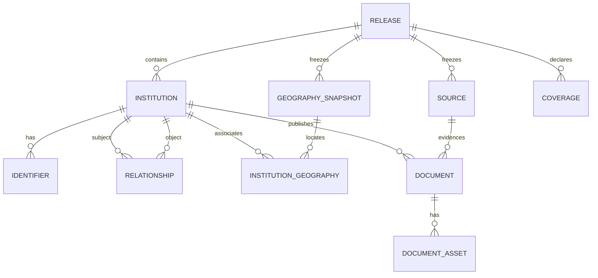
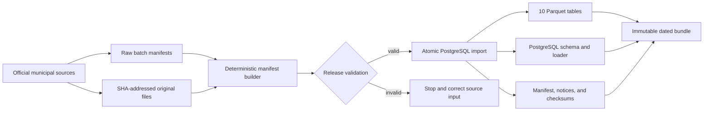

# Canadian public institution ontology

## Product contract

The ontology is distributed as complete, dated, immutable snapshots. Each release is a self-contained Parquet bundle that can be loaded into PostgreSQL 15 or newer without access to York Factory.

Corrections never replace a published version. They are released under the next dated version. The release manifest, input manifest, tool version, row counts, and checksums make the build auditable and logically reproducible.

The ontology covers:

- federal, provincial, territorial, regional, municipal, First Nation, Inuit, and Métis governments;
- departments, ministries, agencies, authorities, boards, commissions, Crown corporations, government business enterprises, police, fire, libraries, health, and education institutions;
- administrative hierarchy, predecessors and successors, control, and joint or partial ownership;
- multiple upstream identifiers per institution;
- Statistics Canada geographic associations; and
- annual reports, financial-statement works, their physical files, and source metadata.

## Release model

There is no mutable draft lifecycle in the ontology tables. Source manifests are edited and validated outside the published schema, then one transaction inserts the complete release. Rows are append-only afterward.

Every ontology table is release-scoped. Public joins across releases use `canonical_id`; internal Rails associations retain bigint keys. Composite PostgreSQL foreign keys include `institution_release_id`, preventing children or graph edges from crossing releases.

The ten core tables are:

1. `warehouse.institution_releases`
2. `warehouse.institution_sources`
3. `warehouse.institutions`
4. `warehouse.institution_identifiers`
5. `warehouse.institution_relationships`
6. `warehouse.institution_geography_snapshots`
7. `warehouse.institution_geographies`
8. `warehouse.institution_documents`
9. `warehouse.institution_document_assets`
10. `warehouse.institution_coverages`

The deliberately shallow entity model is:



Every child also carries `institution_release_id`; the database checks that both ends of each association belong to the same release. The diagram omits those repeated release edges for readability.

`warehouse.public_institutions`, mutable institution snapshots, and global ontology sources were deliberately removed. Canonical-ID continuity is enforced by comparing every build with the previous release: identifier reassignment and type changes under an existing ID are errors, while disappeared institutions are warnings requiring review.

## Canonical identifiers

Canonical identifiers are lowercase semantic URL paths. They do not depend on a Build Canada domain.

Examples:

```text
ca/on/york-region
ca/on/markham
ca/on/vaughan
ca/on/york-region/york-regional-police
ca/on/markham/fire-and-emergency-services
ca/fn/example-first-nation
```

Rules:

1. Canonical IDs are never reused for another institution.
2. Renames retain the existing ID and update names in a later release.
3. A genuine successor receives a new ID and a dated `succeeds` relationship.
4. Municipalities and regions are peers. Geographic containment does not imply ownership.
5. Organization namespaces may express a durable responsible jurisdiction, but dated relationship rows are authoritative.
6. Organization identifiers such as ISC band numbers, GC InfoBase IDs, LEIs, and documented provincial object IDs belong in `institution_identifiers`.
7. Statistics Canada CD/CSD codes identify geographies, not governments. They belong on geography snapshots and links; a legal institution can associate with zero, one, or many such areas.
8. `ca/sources/`, `ca/geography/`, and `/documents/` are reserved namespaces and cannot identify institutions.

Geography IDs use one non-redundant form:

```text
ca/geography/csd-2021/1211011
ca/geography/pr-2021/12
```

Document work IDs include type, fiscal year, and semantic variant:

```text
ca/ns/amherst/documents/financial-statements/2025/consolidated
ca/ns/queens-region/documents/financial-statements/2022/general
ca/ns/annapolis-county/documents/annual-report/2025/general
```

Position in an input array is never part of an identifier. A deterministic suffix is permitted only when two genuinely distinct works have identical semantic fields and no stable upstream discriminator.

## Institutions and identifiers

`warehouse.institutions` contains the complete known institution state for one release: canonical ID, official upstream names, website, broad institution type, source-supplied legal form, government level, status, published contact fields, activity dates, descriptions, and basic fiscal defaults.

English and French values are included only when supplied by an authoritative upstream source. Missing translations remain null.

`warehouse.institution_identifiers` supports any number of scheme/value pairs. A scheme/value pair cannot identify two institutions in one release, and at most one value per scheme may be preferred for an institution.

## Relationships

Relationships are directed from subject to object. For example, York Regional Police `administrative_parent` Regional Municipality of York, while a subsidiary `owned_by` its Crown parent.

Supported relationship types are:

- `administrative_parent`
- `reports_to`
- `owned_by`
- `controlled_by`
- `consolidated_into`
- `governed_by`
- `operated_by`
- `member_of`
- `succeeds`

Edges may include validity dates, a primary-parent flag, ownership percentage, ownership basis, notes, and a source. Multiple `owned_by` edges represent joint or partial ownership. A percentage must be between 0 and 100, but disclosed shares are not required to total 100. Equity, voting, statutory, board-appointment, accounting-control, and other bases remain distinct.

Before release, primary administrative-parent edges must form a forest. Graph-wide inference and ownership-total analysis are deferred until real data requires them.

## Geography

Statistics Canada geographies are copied into `institution_geography_snapshots` at build time. A published release never joins live `warehouse.geo_boundaries`, so later boundary edits cannot change an old export.

Every release with a `csd-inventory` coverage assertion contains the complete frozen CSD inventory for its declared vintage. For the 2021 vintage this is exactly 5,161 rows, including municipalities, reserves, settlements, and unorganized or other municipal-equivalent areas. A CSD is an area, not necessarily a legal government.

Each CSD has an explicit authority-resolution status:

- `verified`: at least one governing or administering link is supported by an authoritative crosswalk, source assertion, or exact upstream identifier;
- `provisional`: an authority link exists but is based on an exact-name match or a low-confidence ultimate-jurisdiction fallback;
- `unresolved`: no governing authority is asserted; and
- `legacy` and `not_applicable`: permitted for older releases and non-CSD geographies, but forbidden for CSDs in a complete inventory.

`institution_geographies` supports four many-to-many roles:

- `governs`
- `administers`
- `serves`
- `headquartered_in`

Every link records its match method, confidence, optional validity dates, source, and notes. This keeps a First Nation government distinct from reserves, settlements, or census subdivisions while allowing it to govern or serve several physical areas. `headquartered_in` never implies governance. A province or territory may provisionally `administer` a CSD when the direct local authority has not yet been reconciled; the low confidence and `jurisdictional_fallback` method prevent that fallback from masquerading as verified municipal coverage. Fallbacks are never synthesized for the eight official on-reserve CSD types, Quebec Inuit Category I lands, or Yukon self-government geographies: those remain `unresolved` unless a defensible Indigenous authority link is present.

## Sources, document works, and assets

Sources are copied into each release and uniquely identified within that release. A source records publisher, title, exact URL, retrieval time, licence, attribution, and upstream languages. Sources do not carry file hashes: a checksum must never describe content from a different URL.

`institution_documents` represents report works, not files. It stores the reporting institution, stable semantic ID, type, variant, titles, fiscal period, publication date, durable landing page, preferred download URL, notes, and one publisher source.

Document types keep unlike disclosures separate. In particular, `financial-statements` means the reporting entity's statements, `statement-of-financial-information` represents a B.C.-style SOFI disclosure, and `financial-data-return` represents a standardized provincial return such as Ontario FIR or Quebec municipal financial-return data. A return is never promoted to an audited-statement work merely because it contains financial figures.

`institution_document_assets` represents physical files. It stores SHA-256, role (`final`, `draft`, `amended`, `part`, `container`, or `unknown`), multipart position, preferred status, exact download URL, retrieval time, MIME type, size, rights status, and internal content-addressed archive path.

A draft and final statement are two assets for one document work. Multipart statements are several `part` assets for one work. Agenda packages containing embedded statements use the `container` role and may carry a page locator.

Downloaded originals are stored under:

```text
/Volumes/floppy/york_factory/public_institutions/assets/sha256/<first-two>/<sha256>.<ext>
```

The build and import steps verify safe path containment, existence, SHA-256, byte size, MIME type, and file-format magic or package markers. Audited statements are normally PDF, but source-published DOCX/XLSX originals remain in their native format. Asset-store verification can be skipped for metadata-only development, but is mandatory for a release build.

The release-level licence statement is `NOASSERTION`; the mixed upstream licence, attribution, and rights status are recorded per source and asset. Bundle-relative archive paths are exported only for assets explicitly marked redistributable.

The national shallow release uses Statistics Canada 2021 as its frozen common geography vintage. Current provincial legal boundaries that do not have a census-year vintage remain source metadata until the geography model gains a source-dated `vintage_on` representation; they are not forced into a false 2021 snapshot.

## Deterministic build

The provincial municipality process is:



Corrections loop back through the source inputs and produce a new dated release; a published release is never edited in place.

The national assembler imports all jurisdiction manifests and the normalized First Nations manifest in one outer transaction:

```sh
bin/rails 'institution_ontology:import_national[YYYY-MM-DD,semicolon-separated-manifests,normalized-first-nations-manifest,first-nations-asset-inventory,csd-inventory,semicolon-separated-csd-authority-crosswalks]'
bin/rails 'institution_ontology:export[YYYY-MM-DD,/Volumes/floppy/york_factory/public_institutions/releases/public-institutions-YYYY-MM-DD]'
```

If a manifest, relationship, identifier, geography, document, or asset fails validation, the complete national import rolls back.

Nova Scotia, Alberta, and British Columbia each produce a jurisdiction manifest with the same contract. Alberta uses the provincial Municipal Affairs roster and audited-statement archive. British Columbia uses the CivicInfo directory and follows report links from each official municipal site. Exact report PDFs are retained in the shared content-addressed store; every document work points to its own landing-page or download source rather than merely to a general municipal homepage.

The British Columbia snapshot also demonstrates temporal and geographic edge cases. A government may be present in an upstream directory but remain `proposed` until its legal activation date. A First Nation government district may govern more than one StatsCan CSD, while a newly incorporated municipality may have no exact CSD in the frozen 2021 vintage; the build records the absence instead of inventing a false match.

The builder:

- requires the release version and effective date to match;
- refuses to overwrite an existing output manifest;
- derives all timestamps from frozen inputs rather than `Time.now`;
- deduplicates files only by exact SHA-256 or normalized exact URL;
- never merges works with fuzzy title similarity;
- retains append-only per-batch scrape audit records;
- checks institution continuity against the previous release; and
- records every raw input's SHA-256 and byte size.

Reproducibility means identical logical rows under a pinned toolchain. Parquet bytes are not promised to remain identical across different DuckDB or compression versions, so the DuckDB version is recorded in the release manifest.

## Parquet release layout

```text
public-institutions-YYYY-MM-DD/
  manifest.json
  checksums.sha256
  LICENSE.txt
  NOTICE.txt
  postgres_schema.sql
  load_into_postgres.sql
  releases.parquet
  sources.parquet
  institutions.parquet
  identifiers.parquet
  relationships.parquet
  geographies.parquet
  institution_geographies.parquet
  coverage.parquet
  documents.parquet
  document_assets.parquet
```

Parquet uses Zstandard compression. Geometry is WKB with SRID 4326 and loads into PostgreSQL as `bytea`, so PostGIS is optional for consumers. `coverage.parquet` distinguishes complete, partial, not-searched, not-found, unavailable, and failed source coverage; missing documents are therefore not silently presented as proof that none exist. The generated loader is atomic and insert-only: attempting to load an existing version fails instead of silently replacing it.

## Deferred additions

The following are intentionally outside version 1:

- extracted financial line items and a normalized chart of accounts;
- many-to-many document/source evidence;
- canonical-ID redirects and former-ID aliases;
- identifier and geography-association validity intervals;
- fine-grained year-by-year coverage intervals;
- graph-wide cycle and ownership-total inference;
- redistributable binary asset bundles;
- automated institution reconciliation; and
- an ontology HTTP API.

These can be additive tables or delivery layers without changing the ten-table release contract.
